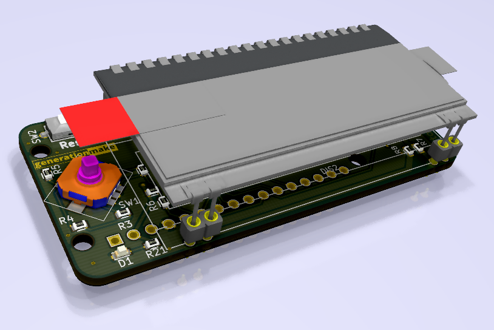
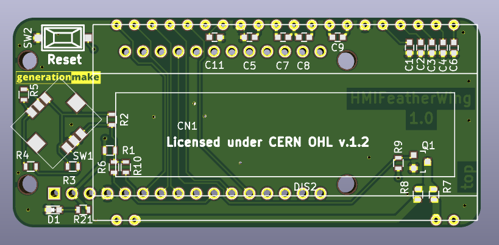
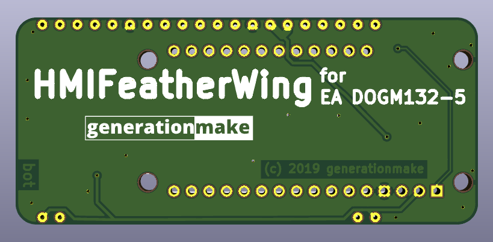

# HMIFeatherWing
HMI FeatherWing with EA DOGM132-5 2.1" display and joystick compatible to Adafruit Feather

##PCB

###Top

###Bottom

## License

This hardware is licensed under the CERN OHL v. 1.2
